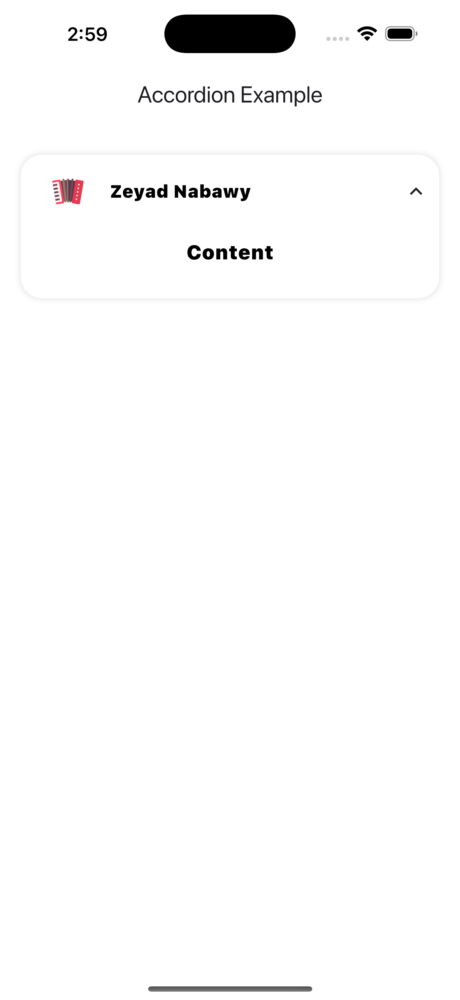
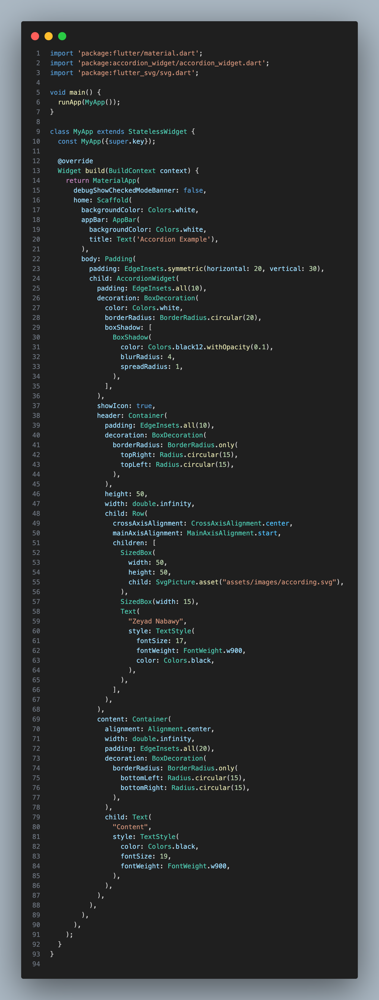

# Accordion Widget

A highly customizable and lightweight Flutter package for creating accordion-style UI components.

## Features
- Fully customizable UI
- Smooth animations
- Support for dynamic content
- Easy integration with existing Flutter apps

## Installation
Add this to your `pubspec.yaml` file:

```yaml
dependencies:
  accordion_widget: latest_version
```

Then, run:
```sh
flutter pub get
```

## Usage
Import the package:
```dart
import 'package:accordion_widget/accordion_widget.dart';
```

Example usage:
```dart
AccordionWidget(
  title: "Tap to Expand",
  content: Text("This is the expanded content"),
  expandedIcon: Icons.keyboard_arrow_down,
  collapsedIcon: Icons.keyboard_arrow_right,
)
```

## Screenshots
| Collapsed | Expanded |
|-----------|---------|
|  |  |

## About the Developer
This package is developed and maintained by **Zeyad Nabawy**, a passionate Flutter developer focused on creating efficient and reusable UI components.

### Connect with me:
- [GitHub](https://github.com/Nabawy12)
- [LinkedIn](https://www.linkedin.com/in/zeyad-nabawy-639877218/)
- [Email](mailto:ZeyadNabawy118@gmail.com)

## License
This project is licensed under the MIT License - see the [LICENSE](LICENSE) file for details.

